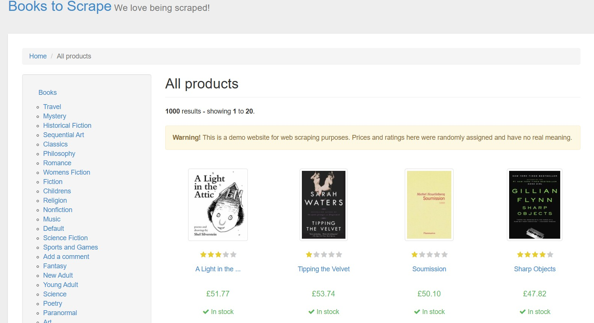

# Scraping Books to Scrape


# About this Project
OpenClassrooms Python Developer Project: Use Python Basics for Market Analysis.
A simple Python ETL pipeline that scrapes book data from Books to Scrape, extracts prices and metadata, downloads book cover images, and packages everything into a ZIP file.
This project is ideal for beginners learning web scraping, ETL workflows, and Python project structure.

### **Project's Scenario:**

You are a marketing analyst at Books Online, a major online used bookstore. As part of your role, you manually keep track of used book prices on rival websites, but you can’t keep up. There are too many books and too many online bookshops! So, you and your team have decided to use Python to build a monitoring system that extracts pricing information from other online bookshops.
Your team leader, Sam, has asked you to build a beta version of the monitoring system to track book prices at Books to Scrape, an online book retailer. For the beta version, the system won’t actually ‘monitor’ retailer book prices through time. Instead, it will just be an application that can be run on-demand to extract prices from Books to Scrape.
&nbsp;
### **Requirements:**
&nbsp;
1- You need to have python (obviously)

2- Install `BeautifulSoup`
```bash
pip3 install beautifulSoup4
```
3- On your Python code you need to import it
```python
import BeautifulSoup
```

# Features
- Scrapes all book titles, prices, ratings, availability, categories

- Extracts product page URLs and image URLs

- Downloads all book cover images

- Saves structured data into a CSV file

- Packages all extracted data into a ZIP file

- Fully modular code (scraper, utils, pipeline)

# Implementation of the ETL process:

- Extract relevant and specific data from the source website;

## 📁 Project Structure


- Transform, filter and clean data;
- Load data into searchable and retrievable files.
